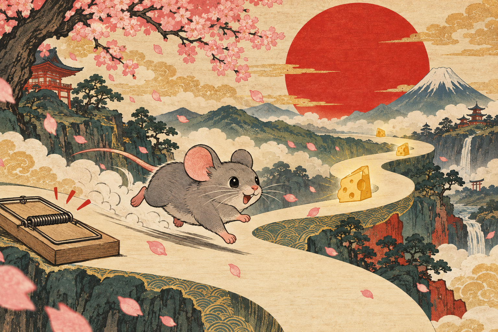

# RATÓN (ラトン) — el juego del queso



Un **endless runner vertical de 3 carriles** pensado para el móvil: perfecto para
el tren, el café o la sala de espera. Eres un ratoncito japonés muy decidido:
esquiva **trampas de ratón**, come **queso** y acumula **AURA** dorada rozando el
peligro. Estética de arte japonés moderno: papel washi, tinta, bermellón y pétalos
de sakura.

---

## Cómo se juega

| Acción | Efecto |
| --- | --- |
| **Deslizar ← / →** (o tocar mitad izq/der, o flechas del teclado) | Cambiar de carril |
| **Queso** | **+100 m** de distancia. Quesos seguidos = **combo** (×2, ×3…) |
| **Trampa de ratón** | Fin de la partida. Una y se acabó la fiesta |
| **Rozar una trampa** (near-miss) | **+1 AURA**: multiplica la velocidad a la que ganas metros y envuelve al ratón en llamas doradas |
| **Cada 500 m** | Celebración con pétalos y acorde de koto |

### Opciones (menú ⚙ o en pausa)

- **Efectos**: volumen maestro (0–100) y silencio total.
- **Música de fondo**: interruptor + volumen propio. Es un secuenciador *live*
  sobre escala **Miyako-bushi** (koto, bajo, drone y taiko) que **sube de tempo y
  densidad con la velocidad del juego**; se pausa con la partida.
- **Controles táctiles**, elegidos a tu gusto:
  - **Deslizar** — táctil puro: arrastra el dedo (también vale un toque rápido a un lado).
  - **Zonas** — toques invisibles `< >`: toca la mitad izquierda o derecha.
  - **Botones** — lo mismo que Zonas, pero con botones `< >` visibles en pantalla.
  - **Giroscopio** — inclina el celular a los lados para moverte (pide permiso de
    orientación en iOS la primera vez).
- **Vibrar**: activa/desactiva la vibración háptica.

Todo se guarda automáticamente en el dispositivo.

### Vidas y power-ups

- **Band-Aid (🩹)**: son tus vidas. Empiezas con **3** (máx **9**). Tocar una
  trampa quita una; con 0 vidas se acaba la partida. Son **muy raras** de ver.
- **Fresa (🍓)**: muy rara y **no acumulable**; activa un **×20** a la distancia
  por queso durante **10 segundos** (indicador 🍓 ×20s en pantalla).
  Volver a cogerla reinicia los 10 s, nunca los suma.

Tu **mejor distancia se guarda automáticamente** en el dispositivo con
**IndexedDB** (con espejo en localStorage), junto con partidas jugadas, quesos
totales y aura máxima.

## Stack

- **React 19 + Vite 7 + TypeScript**
- **Tailwind CSS 4**
- **Canvas 2D** — todo el arte es procedural (sin sprites), estilo ukiyo-e moderno
- **Web Audio API** — sonido 100 % procedural con escala pentatónica japonesa
- **Framer Motion** — menús y el sello hanko de nuevo récord
- **IndexedDB** — persistencia del récord
- **gh-pages** — despliegue a GitHub Pages

## Inicio rápido (desarrollo)

```bash
npm install
npm run dev
```

Abre la URL local y, para probarlo como en el móvil, usa las herramientas de
desarrollo del navegador en modo dispositivo (o sírvete la IP local desde tu
teléfono).

## Despliegue en GitHub Pages (repo "Raton")

### Paso 0 — una sola vez por máquina

Necesitas [Node.js](https://nodejs.org) y [Git](https://git-scm.com) instalados y
tu identidad de git configurada:

```bash
git config --global user.name  "Tu Nombre"
git config --global user.email "tu@email.com"
```

### Paso 1 — prepara el repo

1. Crea en GitHub un repositorio llamado **`Raton`** (público).
2. En tu PC, en la carpeta con estos archivos:

```bash
git init
git add .
git commit -m "RATON: primera version"
git branch -M main
git remote add origin https://github.com/TU-USUARIO/Raton.git
git push -u origin main
```

### Paso 2 — despliega (doble clic)

Ejecuta **`deploy.bat`** (Windows). El script hace exactamente:

```
npm install   →   npm run build   →   npx gh-pages -d dist
```

y publica el contenido de `dist/` en la rama **`gh-pages`** de tu repo.

> Si prefieres hacerlo a mano o estás en Mac/Linux:
> ```bash
> npm install
> npm run build
> npx gh-pages -d dist
> ```

### Paso 3 — activa Pages en GitHub

En tu repo: **Settings → Pages → Source: rama `gh-pages`, carpeta `/ (root)` → Save**.

En 1-2 minutos tu juego estará en:

```
https://TU-USUARIO.github.io/Raton/
```

### ¿Por qué funciona sin configurar nada más?

`vite.config.ts` usa `base: "./"`, así todos los assets se cargan con rutas
**relativas**: el juego funciona en cualquier subcarpeta de GitHub Pages, en tu
usuario `.github.io`, en un dominio propio y hasta abriendo el `dist` en local.
Si algún día quieres rutas absolutas, cambia `base` a `"/Raton/"`.

> Opcional: si quieres el comando clásico `npm run deploy`, añade a
> `package.json`, dentro de `"scripts"`:
> `"deploy": "gh-pages -d dist"`

## Estructura del proyecto

```
├── deploy.bat              ← script de despliegue (install → build → gh-pages)
├── index.html              ← título, icono, meta móvil, fuentes japonesas
├── vite.config.ts          ← base "./" para GitHub Pages
├── public/
│   ├── icon.png            ← icono de la app / favicon
│   └── og.png              ← portada social (Open Graph)
└── src/
    ├── App.tsx             ← orquesta menú / juego / game over
    ├── game/
    │   ├── engine.ts       ← motor: carriles, patrones, aura, combo, partículas
    │   ├── draw.ts         ← arte procedural: ratón, trampa, queso, torii, nubes
    │   ├── audio.ts        ← sonido procedural (Web Audio) con volumen maestro
    │   ├── db.ts           ← IndexedDB (mejor distancia, estadísticas)
    │   └── settings.ts     ← ajustes persistidos (volumen, silencio, controles)
    └── components/
        ├── Menu.tsx        ← portada con récord, ratón animado y ⚙ opciones
        ├── GameScreen.tsx  ← canvas, HUD, 3 modos de control, pausa + opciones
        ├── GameOver.tsx    ← panel final + sello hanko de récord
        ├── SettingsPanel.tsx ← panel de opciones (menú y pausa)
        └── CheeseIcon.tsx  ← icono de queso
```

## Afinar el juego

Todas las constantes de diseño están al principio de
[`src/game/engine.ts`](src/game/engine.ts):

| Constante | Significado | Valor |
| --- | --- | --- |
| `START_SPEED` | Velocidad inicial (px/s) | `260` |
| `MAX_SPEED` | Velocidad máxima | `680` |
| `RAMP_T` | Segundos hasta la velocidad máxima (rampa gradual) | `110` |
| `PX_PER_M` | Cuántos píxeles equivalen a 1 metro | `52` |

Cada nivel de trampas se valida con `fixTrapLevel()`: **siempre existe un
camino alcanzable** (máx. 1 carril por hueco) entre patrones consecutivos.
`enforcePassable()` es el seguro final contra muros de 3 trampas.

### Topes de recursos (rendimiento estable en móviles modestos)

| Constante | Límite | Qué pasa al superarlo |
| --- | --- | --- |
| `MAX_ENTITIES` | `3` en pantalla | entra una nueva y sale la más antigua que **ya pasó** al ratón (sin pops a la vista) |
| `MAX_PARTICLES` | `30` | cola FIFO: se descarta la partícula más vieja |
| `PETAL_RESERVE` | `10` | siempre quedan partidas para los efectos de comer/chocar |
| `MAX_FLOATS` | `4` | los textos flotantes viejos se retiran antes de terminar |
| `MAX_DECOR` | `10` | matas, piedras y torii de los márgenes se reciclan |

El hueco entre filas se mide en **tiempo de reacción** (0.75 s → 1.25 s), así que
en píxeles crece con la velocidad: más rápido = más distancia vertical, jamás
elementos solapados ni agrupaciones injugables.

En `spawnRow()` puedes ajustar el peso de cada patrón (trampas dobles, cebos,
filas de queso, zig-zag…) y en `auraMult()` el poder del aura.

## Privacidad

El juego no envía nada a ningún servidor: el récord vive únicamente en el
IndexedDB de tu navegador. Para reiniciarlo: borra los datos del sitio desde los
ajustes del navegador.

## Licencia

MIT — haz lo que quieras con él, pero si tu ratón bate récords, cuéntanoslo.
